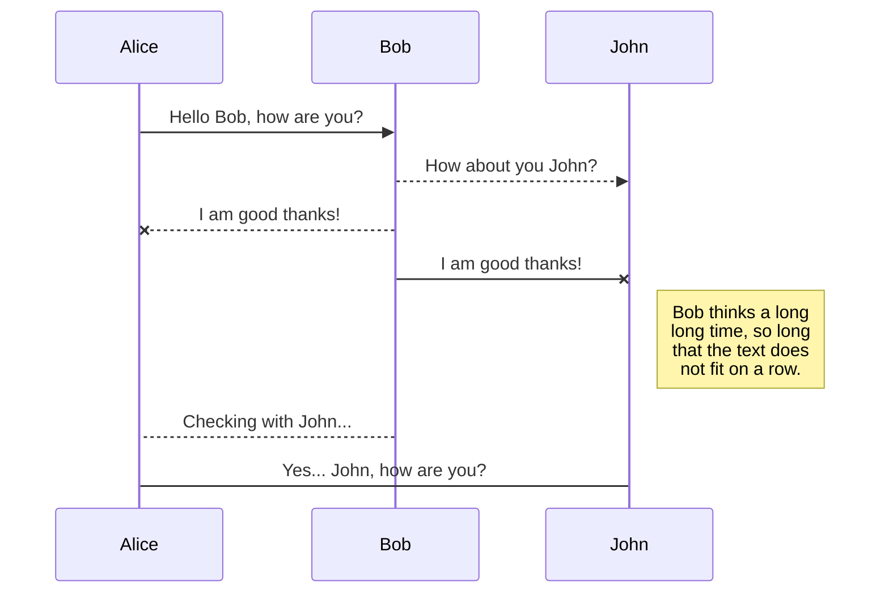

## 关于夏末镇の相关管理规定

 - 加入本镇即同意本镇相关的管理规定。   加入本镇即同意并自愿参与本镇所有公共设施建设项目。
 - 加入本镇即同意并自愿维护本镇的相关荣誉与相关资源。   本镇支持并尊重每位镇民的思想自由，但请各位镇民注意自己的言行举止。  
 - 请自觉维护本镇相关的公共资源及设施，严禁破坏！出现损坏请联系相关人员维护。（故意损坏公共资源、设施将追究其相关责任。）
 - 请保持良好的语音环境，请勿出现炸麦以及噪音。
 - 禁止对他人发生性骚扰，禁止传播谣言、污秽、暴力等信息。禁止盗窃以及恶意毁坏他人建筑、物品。（前者违反，前两次警告，第三次将纳入黑名单。后者若经核实确实有此类行为，直接纳入黑名单。举报有奖。）
 - 本镇主要的公共资源与设施目前只对镇内成员（包括部分特许人员）开放使用，为避免发生冲突，请勿随意带镇外人员进入。
 - 对于相关的镇内建筑建设（特别的大型的红石科技建筑）请提前向相关管理人员上报，进行土地规划。（未上报的建筑将会被视为违规建筑，违规建筑将会被拆除！！！）在镇内进行的建筑请遵守相关规定《夏末镇建筑与商铺管理规定》。夏末镇建筑与商铺管理规定.docx

 

 - 请自觉遵守本镇相关管理规定，违反者经三次警告后将纳入黑名单，不在享有本镇任何权益！
 - 如相关管理人员出现失职，请及时检举。将会对相关失职人员进行调整以及相应的处罚。

 

 - 本镇尊重并欢迎外来社会人员参观（黑名单人员及相关除外），请外来社会人员阅读并遵守本镇的相关规定《夏末镇对外来社会人员参观管理告知》否则一律按黑名单人员处理。夏末镇对[外来社会人员参观管理告知.docx](https://docs.qq.com/doc/DR29LV2RzZm9wcUxH#g=X2hpZGRlbjpoaWRkZW4xNzIyMTQxOTU5NjYz)
 - 请各位镇民自觉远离xin_nian，以及远离相关黑名单人员与黑名单地区。
 - 严禁与其他镇成员发生冲突，如有发生不必要冲突请自行解决，请勿将本镇集体代入。违者黑名单处理并禁止使用夏末一切公开设施。
 - 若出现建筑被恶意损毁或物品丢失请及时联系相关管理人员，将追究其相关责任。   禁止未经允许进入别人家翻箱倒柜，参观请看各家门口注意事项。
 - 公共设施为夏末全体成员共有，严禁私人占用。
 - 自觉遵守相关管理规定，听从相关管理人员安排。（如因管理人员安排出现问题，请在各向事务安排完后再与管理人员进行协商。）

>  以上所有解释权归夏末镇管理机关所有。

